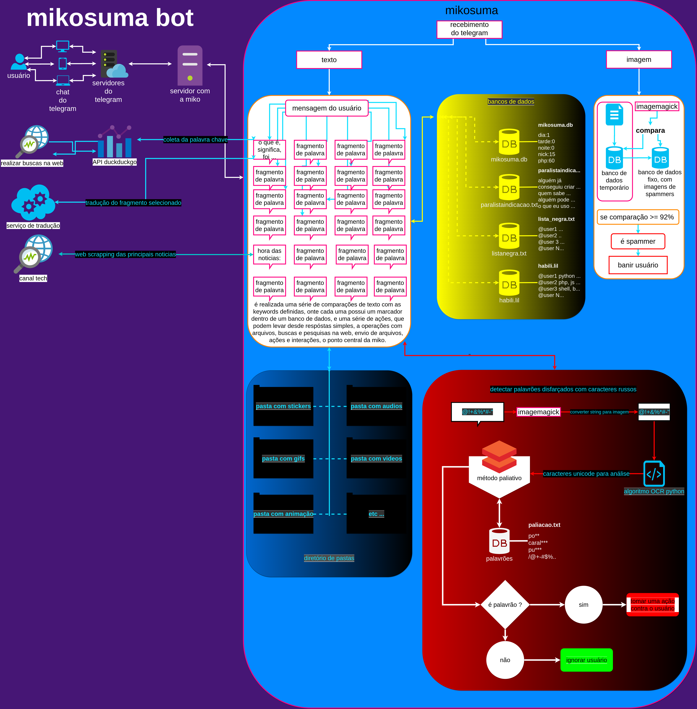
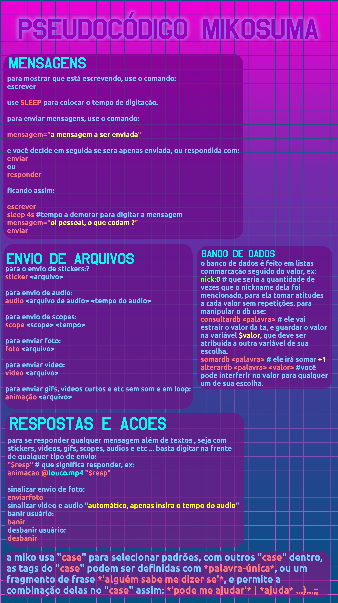

# mikosuma

**mikosuma** é um projeto de bot para telegram, capaz de gerenciar um grupo completo **apenas** pela linguagem natural, agindo como uma humana comum, capaz de realizar as seguntes coisas:

1. atender novos integrandes;
2. fazendo checagens para verificar se são pessoas ou bots;
3. verificar imagens para ver se é algum tipo de spam ou propaganda;
4. transcrever audios e interpretar os audios;
5. buscar significado de palavras;
6. reconhecer e marcar dúvida das pessoas;
7. buscar cursos gratuitos nas plataformas de cursos;
8. sensurar palavrões ou mensagens com um tom de ameaça;
9. criar enquetes por conta própria ( porém pré configuradas, nada de forma automática e por conta própria ainda );
10. fixar soluções de dúvidas;
11. categorizar habilidades dos integrantes;
12. mandar audios de forma humana;
13. mandar stickers;
14. mandar fotos;
15. mandar videos em scope;
16. mandar arquivos;
17. responder a mensções ao seu nome ou apelido;
18. interagir com bom dia, tarde e noite;
19. fazer leves brincadeiras;
20. detectar spammers por palavras chave e links maliciosos;
21. realizar anotações interna das dúvidas, habilidades, e usuários sendo avaliados.
22. simular algumas breves dúvidas em alguns assuntos para dar assuntos ao grupo ( apenas com algumas duvidas configuradas, sobre PHP, e comentários sobre inteligencia artificial. )

segue alguns exemplos, fluxogramas e pseudocódigo da mikosuma ( nem todos atualizados, fazemos evoluções diárias ):
## fluxograma de funcionamento resumido de algumas funções

## pseudocódigo
permite a criação de roteiros de interação de forma fácil, sem a necessidade de saber muito para poder construir interações.

# depedências
´´´
jq, imagemagick, ffmpeg, python3, speech_recognition (python), curl, 
´´´
